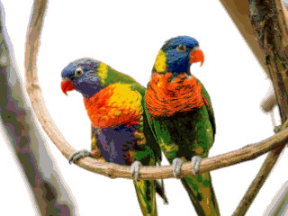

## Parrot bitmap image

This demo shows how to display the following bitmap image on Zeal 8-bit Video Board:



The size of this image is 320x240px (downscaled from the original one) and reduced to 256 colors maximum.

### How it works

Zeal 8-bit Video Board doesn't support graphics bitmap mode, it always works with tiles. However, it is possible to simulate a bitmap mode depending on the number of colors and the number or repeated pattern an image represents.

For example, the image above has 194 different colors and 227 different tiles (white parts of the image can be re-used), making it an ideal candidate for this demo.

As a reminder, in 8-bit color mode, the video board supports up to 256 different tiles, while in 4-bit color mode, it supports up to 512 different tiles. In this demo, the 8-bit color mode is be used. In both cases, the colors are taken from a palette that can be customized with RGB565 entries.

### Preparing the image

The GIMP plugin, present in the `tools/` directory at the root of this project was used to export this image's tileset, its palette, and its tilemap to the vide board format. These files can be found under the `assets/` directory.

These binary files are imported in the assembly code thanks to the `INCBIN` directive. Since `z88dk-z80asm` supports sections, a dedicated section has been created for the tileset.

### What the program does

The source file, `parrot.asm`, is meant to be compiled with `z88dk-z80asm`. The resulted binary must be run **without** any OS, hence the `ORG 0` at the beginning. Moreover, it **doesn't** rely on any library, it is standalone.

Here are the steps to show the image, let's omit the core related details (like mapping the VRAM and setting the stack):

* Disable the screen: no mandatory but it will prevent screen artifacts/garbage during split seconds
* Switch to graphics 320x240 8-bit color mode
* Copy the parrot tileset to the video board tileset RAM (physical address `0x110000`)
* Copy the parrot color palette to the video board palette RAM (physical address `0x100E00`)
* Copy the parrot tilemap to the video board layer0 (background)
* Fill the tilemap layer1 (foreground) with an "empty" tile, i.e. a tile that only has transparent pixels
* Enable the screen

And that's it!

### Compiling

To compile the demo, simply use:

```
make
```

Keep in mind that you will need `z88dk`'s `z80asm` to assemble the program.

> [!IMPORTANT]
> The resulting binary that contains both the program and the parrot image data is `parrot.bin.img` and **NOT** `parrot.bin` (which only contains the code). Therefore, to test on the real hardware, the `parrot.bin.img` file must be flashed.

### License

This demo (`parrot_demo/`) is distributed under the CC0-1.0 License.
