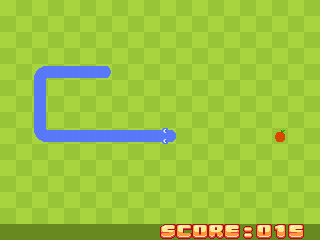

## Snake game

This example implements the famous Snake game, where you control a snake and you have to eat all the apples that appears one after the other. The goal is to eat as many apples as possible and make your snake loooooong...



The goal of this example is to show how to use the Zela 8-bit Video Board library implemented with and for *SDCC C compiler*.

### Presentation

This game is implemented in C. This was made possible thanks to [Zeal 8-bit OS](https://github.com/Zeal8bit/Zeal-8-bit-OS), which supports C programs compiled with SDCC. As such, this example **cannot** be executed as a raw/standalone binary, it needs to be executed within Zeal 8-bit OS. In fact, the OS gives us a very convenient way to read inputs from the keyboard without having to decode and handle all the events ourselves, making the game more concise and focused on its goal: the gameplay.

The Zeal 8-bit Video Board (ZVB) compiled library is necessary to compile this example, please refer to the [README.md](../../README.md) at the root of this repository.

The game runs in the 8-bit colors 320x240px graphics mode, it takes advantage of the two tilemap layers to show the background independently from the foreground (snake and apples). It doesn't use any sprites, it only uses the tiles to make the snake move.

### Compiling

To compile the demo, you will need both the Zeal 8-bit OS headers and the compiled Zeal 8-bit Video Board SDK, then make sure you defined both environment variables:
```
export ZVB_SDK_PATH=/path/to/zeal-svb-sdk
export ZOS_PATH=/path/to/zeal-8bit-os
```

After defining both, you can simply use:

```
make
```

Keep in mind that you will need `sdcc` v4.2.0 or newer to compile the program.

> [!NOTE]
> The resulting binary that contains the game is `bin/snake.bin`. This binary can be embedded to a Zeal 8-bit OS romdisk image or transferred via UARt to Zeal 8-bit Computer to be executed there.


### Tileset

The original tileset for the snake, released under the CC0 license, comes from [this page](https://opengameart.org/content/snake-game-assets). It has been modified by me to better fit the Zeal 8-bit Video Board (colors, pixels details, re-organized as a tilesheet, etc...). It is not compressed, it is a raw `zts` file.

The text font originally comes from [this tilesheet](https://opengameart.org/content/pixel-block-font), it was released under the CC-BY 3.0. It has been reworked by me to fit in 16x16px tiles instead of the original 12x32px. Since it uses less than 16 colors, it was "compressed" by discarding upper nibbles of all pixels. In other words, a byte represents two pixels (hence the use of `TILESET_COMP_4BIT` when loading it using the ZVB lib API)

The rework was done under GIMP, the resources have then been exported using the plugin presented in `tools/` directory at the root of this repository.

### Limitations

* Since the game is written in C, the generated binary is heavy (~13KB) compared to Z80 hand-written assembly.
* The game currently doesn't have any sound, as soon as the sound library is implemented in this SDK, it would be fairly easy to add some sound effects.
* It is not possible to exit back to the OS, it is recommended to perform a hard reset to go back to the OS.

### Improvement ideas

* Add a main menu to start a game, see the high scores or exit the game
* Add sounds as soon as the SDK implements the API
* Use sprites to have smoother movement

### License

This demo (`snake/`) is distributed under the CC0-1.0 License.
