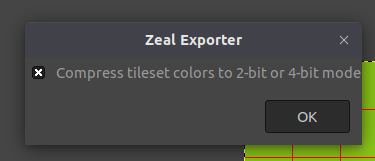

This project implements a GIMP extension that can be used to export images to the image format expected by Zeal 8-bit Video Board.

## Purpose

While making demos for Zeal 8-bit Video Board, it could get tricky and redundant to write scripts that take a picture or a (png/jpg) tileset and try to cut and export it to fit the format expected by the video board.

Indeed, by default, when a bitmap image is exported as a bitmap image, the pixels are written linearly, from top left to bottom right or from bottom right to top left. In both cases, they don't have the notion of tiles.

Let's say we have an image of 160x160px and give a number for all the pixels, from 0 (top left) to 25599 (bottom right). If we export it as a regular bitmap image, the pixels will be ordered sequentially: 0, 1, 2, 3, 4, ..., 22598, 2599.
If we organize the image as 16x16px tiles, the first 256 bytes of the exported images should be the pixels [0, 1, 2, ..., 160, 161, 162, ..., 320, 321, 322, ..., 2414, 2415] because the first tile would take the first 16x16px square of the image.

This is exactly what this plugin is about, it will split the image into tiles are arrange these tiles sequentially in the resulting binary file. It will also save the palette in another file, as well as the tilemap formed by this image (useful in case there are redundant tiles).

## Output file format

To export a given image to Zeal Video Board file format, make sure it has a width and a height multiple of 16, this is required since all the tiles on the video board are 16x16px big. The color mode of the image must be indexed, in other words, it must use a color palette. It palette can have any number of colors between 2 and 256 included, but keep in mind that 2-color and 16-color palettes are a bit special since they can be optimized in size by the plugin.

Three files are generated by this plugin:
* The palette file, containing all the colors of the palette, in RGB565 format. Each entry is in little-endian. The maximum size of this file is 12 bytes (256 16-bit colors)
* The tilemap file, containing all the tiles (index) in the same order as in the source image.
* The tileset file, containing all the different tiles that compose the source image. The plugin will detect if any pattern (tile) is repeated in the image, and if that's the case, it will only store that tile once in the resulting file.
  * The tiles are stored linearly, in the file from top to bottom, left to right (check [Purpose section](#purpose)).
  * By default, each pixel of each tile takes **one byte**, so one tile is `16*16=256` bytes.
  * If the palette contains between **3 and 16 colors**, it is possible to store each pixel in a **nibble** (4-bit), making each tile **128 bytes** (*)
  * If the palette contains 2 colors, it is possible to store each pixel in a **bit**, making each tile **32 bytes** (*)
  * In all cases, it is possible to save this file as a compressed tileset, by using the `.zcts` (*Zeal Compressed TileSet*) extension. The plugin will compress the tileset thanks to the RLE algorithm, where a byte `0xNN` is ` >= 0x80` to signify that the next byte must be repeated `0xNN - 0x80 + 1`, or`0xNN` is `< 0x80` to signify that the next `0xNN - 0x80 + 1` bytes must be copied as is to the destination. Check the `tile_compress` function of `zeal_zts_c.c` file for more information about the implementation.


(*) A prompt will be shown while saving the file, asking the user whether to optimize the output file or not. Keep in mind that the Video Board doesn't natively support these optimization, so it is necessary to write a Z80 program that converts back these bits and nibbles back to bytes. The C implementation of the SDK implements these features:



## Prerequisites

You will need to install `libgimp2.0-dev` first to install the plugin. On Debian based distributions, the following command can be used:

```
sudo apt install libgimp2.0-dev
```

You can then verify that it is properly installed:

```
gimptool-2.0 --version
```

## Installing

To install the plugin, you simply need to use the following command:

```
make
```

Make sure to close or reopen the current instance of GIMP if it is already opened.

## Usage

Here are the steps to export an image to Zeal 8-bit Video Board format:

* Open the image in GIMP
* Make sure the image width and height are both multiples of 16px (since tiles on the video board are 16x16px)
* Make sure to choose the color mode to `Indexed` in the `Image > Mode > Indexed...` menu
* Choose the maximum number of colors to use for the image (256 colors at most for the video board)
* Export the image via `File > Export...` or Ctrl + Shift + E
* Name or choose the extension `.zts` for *Zeal TileSet* or `.zcts` for *Zeal Compressed TileSet*
* Click `Export`

Three files should be generated:
* `.ztp`: the palette, where all the colors are in RGB565 format, in little-endian
* `.zts`: the tileset, where all the 16x16px tiles of the image have been exported
* `.ztm`: the tilemap, the index of each tile used from the tilemap. This is convenient for exporting animations or (bitmap) images